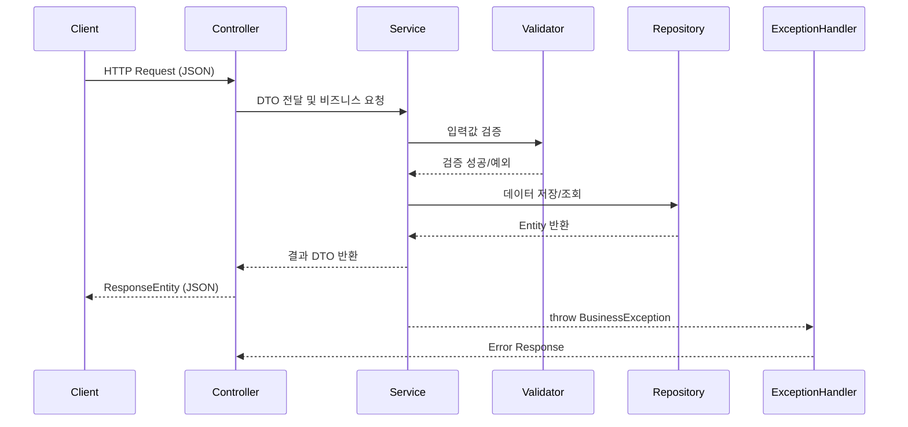

# KTB3_juncci_BE_SPRING

 WEEK04 과제 프로젝트로,  
**회원가입 / 로그인 / 게시판 기능**을 중심으로 한 RESTful API 서버를 구현하였습니다.

## 주요 기능
- 사용자 회원가입 및 로그인 
- 게시글 작성 / 수정 / 삭제 / 조회
- 댓글 작성 / 삭제 / 조회
- 좋아요 토글
  
## 프로젝트 구조 (Architecture Overview)

이 프로젝트는 Spring MVC 기반으로 구성된 **5계층 아키텍처**를 따르며,
각 계층은 **단일 책임 원칙(SRP)** 과 **의존성 역전 원칙(DIP)** 을 준수하도록 설계되었습니다.


---

### 1. Controller Layer

* **책임:** 클라이언트의 요청을 수신하고 적절한 `Service`를 호출하여 응답을 반환
* **구성 클래스:**

  * `UserController` — 회원가입, 로그인, 이메일 중복 확인
  * `PostController` — 게시글 작성, 수정, 삭제, 조회
  * `CommentController` — 댓글 작성, 삭제, 조회
  * `LikeController` — 게시글 좋아요/취소

**주요 역할**

* HTTP 요청을 JSON DTO로 변환 (`@RequestBody`, `@RequestParam`)
* `ResponseEntity`로 상태 코드와 응답 메시지 반환
* 예외 발생 시 `GlobalExceptionHandler`에 위임

---

### 2. Service Layer

* **책임:** 핵심 비즈니스 로직 수행
* **구성 클래스:**

  * `UserService`
  * `PostService`
  * `CommentService`
  * `LikeService`

**주요 역할**

* 비즈니스 규칙 처리
* `Validator` 호출을 통한 유효성 검증
* `Repository` 접근을 통한 데이터 조작
* `BusinessException` 발생 시 `GlobalExceptionHandler` 전달

---

### 3. Validation Layer

* **책임:** 입력 데이터의 유효성 검증 (SRP 준수)
* **구성 클래스:**

  * `UserValidator`
  * `PostValidator`
  * `CommentValidator`

**주요 역할**

* 이메일 형식, 비밀번호 규칙, 제목 길이 등의 검증
* 예외 발생 시 `BusinessException` 던짐
* Controller와 Service의 책임 분리

---

### 4. Repository Layer

* **책임:** 데이터의 저장/조회/삭제
* **구성 클래스:**

  * `DummyUserRepository`
  * `DummyPostRepository`
  * `DummyCommentRepository`
  * `DummyLikeRepository`

**주요 역할**

* 현재는 **메모리 기반 더미 저장소** (Map 사용)
* 향후 JPA 또는 DB 연동 시 `Repository` 대체 가능
* Service 레이어에만 의존 (Controller는 접근하지 않음)

---

### 5. Model Layer

* **책임:** 애플리케이션에서 사용하는 데이터 구조 정의
* **구성 요소:**

  * **Entity:** `User`, `Post`, `Comment`, `Like`
  * **DTO:** `Request`와 `Response`로 구분 (`SignupRequest`, `PostListResponse` 등)

**주요 역할**

* Entity는 상태 보유, DTO는 데이터 전달 책임
* Controller ↔ Service 간 데이터 교환

---

### 6. Exception Layer

* **책임:** 모든 예외 상황을 중앙집중적으로 처리
* **구성 클래스:**

  * `BusinessException`
  * `ErrorCode` 
  * `GlobalExceptionHandler`

**주요 역할**

* 예외 발생 시 `ErrorCode` 기반으로 상태 코드, 메시지, 상세 정보 구성
* 공통 응답 포맷(`message`, `data`, `error`) 유지
* `ResponseEntity`로 Controller에 응답 반환

---

## 요청-응답 흐름 요약



---

## 계층 간 의존 관계

| From                | To         | 설명         |
| ------------------- | ---------- | ---------- |
| Controller          | Service    | 비즈니스 로직 호출 |
| Service             | Validator  | 입력 데이터 검증  |
| Service             | Repository | CRUD 수행    |
| Repository          | Model      | Entity 관리  |
| Service / Validator | Exception  | 비즈니스 예외 발생 |
| Exception           | Controller | JSON 응답 변환 |

---

## 주요 API 목록 (Endpoints Overview)

| 구분            | Method | Endpoint                   | Status    | 설명                        |
| ------------- | ------ | -------------------------- | --------- | ------------------------- |
| **회원가입**      | POST   | `/users`                   | 201       | 새로운 사용자 등록                |
| **로그인**       | POST   | `/users/auth`              | 200       | 사용자 로그인 및 Access Token 발급 |
| **이메일 중복 확인** | GET    | `/users/check-email`       | 200 / 409 | 사용 가능한 이메일 여부 확인          |
| **게시글 작성**    | POST   | `/posts`                   | 201       | 게시글 등록                    |
| **게시글 수정**    | PATCH  | `/posts/{postId}`          | 200       | 게시글 수정                    |
| **게시글 삭제**    | DELETE | `/posts/{postId}`          | 204       | 게시글 삭제                    |
| **게시글 목록 조회** | GET    | `/posts`                   | 200       | 페이지네이션 목록 조회              |
| **게시글 상세 조회** | GET    | `/posts/{postId}`          | 200       | 특정 게시글 상세 내용 조회           |
| **댓글 작성**     | POST   | `/posts/{postId}/comments` | 201       | 댓글 등록                     |
| **댓글 삭제**     | DELETE | `/comments/{commentId}`    | 204       | 댓글 삭제                     |
| **좋아요 토글**    | POST   | `/posts/{postId}/likes`    | 200       | 좋아요/취소 처리                 |

---

## 에러 처리 구조 (Error Handling)

| 계층                  | 클래스                      | 역할                          |
| ------------------- | ------------------------ | --------------------------- |
| **Exception Layer** | `BusinessException`      | 서비스 로직 중 비즈니스 예외 발생 시 throw |
| **Exception Layer** | `ErrorCode`              | HTTP 상태 코드, 에러 코드, 메시지 정의   |
| **Global Handler**  | `GlobalExceptionHandler` | 모든 예외를 잡아 표준화된 JSON 응답으로 변환 |

에러 응답 예시

```json
{
  "message": "invalid_request",
  "data": null,
  "error": {
    "code": "POST-TITLE-LEN",
    "detail": "게시글 제목은 1~30자 사이여야 합니다."
  }
}
```

> `Service` 혹은 `Validator` 계층에서 예외가 발생하면,
> `BusinessException`이 던져지고 `GlobalExceptionHandler`가 이를 캐치하여
> 클라이언트에게 일관된 형식으로 응답합니다.


